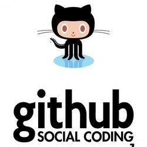

# 一个平易近人的GitHub入门

**By：VeronicaSun**

这是个致力于“零术语”的GitHub入门，同为菜鸟，且是这个领域食物链底端的文科女，我深切的理解“这上面的字都认识，但是连在一起是在说毛呢”的感受。

说是入门，不如说是这段时间以来我使用GitHub总结出的一些理解。祝想要跨进大门里的你们可以轻轻松松地抬脚、坚定前行。

开始前，先安利两个大神的文：

[GitHub入门到精通](http://blog.csdn.net/hcbbt/article/details/11651229/)

[使用GitHub](http://www.liaoxuefeng.com/wiki/0013739516305929606dd18361248578c67b8067c8c017b000/00137628548491051ccfaef0ccb470894c858999603fedf000)

## 什么是GitHub

百度百科把它归为“开源代码库”。我想先从GitHub的logo上的那串英文“social coding”说起：social coding，顾名思义，大概就是说让大家都能参与进编程当中。因此，和Git相比，GitHub致力于推倒我们和程序猿之间的围墙，让普通人有机会理解、参与编程活动——这是非常有意义的，因为不仅有助于让程序猿写出更“亲民”的软件，编程的平民化也让参与其中的我们得以发现自己的潜能。

我试着用简单、亲民的类比来向诸位介绍目前我认识中的GitHub：**它是一个集Git，云盘和百度贴吧（或者豆瓣）于一体的网站。**下面我会就这句话中的所有类比分而述之：

* Git：程序猿编程所用的一个平台，GitHub作为它的衍生品当然首先具备Git的功能（这一部分在还未接触到代码等等的时候可以暂且放到一边）

* 云盘：GitHub的Code部分不仅仅是程序猿用来储存写好的代码的地方，我们可以在这里上传、保存自己的文件

* 百度贴吧（或者豆瓣）：GitHub的Issue部分可供大家讨论、交流，它的形式类似于百度贴吧或者豆瓣（建议掌握Markdown句法）

* 网站：这里得回到Git与GitHub的关系上。GitHub把Git的功能以网站的形式呈现出来，让我们无需搞懂Git的语言，顺利地写自己的文件。因此GitHub把编程从看上去高不可攀的空中拉到地面

这样看来，GitHub对入门者来说是何等的平易近人。

## 为何要使用GitHub

不管你的目的是不是最终要进入这个领域，GitHub都值得你去探索、使用：

* 安全：作为一个让程序猿们安心储存自己代码的地方，它的安全系数毋庸置疑

* 大储存量：GitHub用一种技术压缩了原本文件的大小，却也保证它维持原状，和云盘相比，你不用苦恼花钱扩容，因为这里是**免费**的

* 页面简洁：没有广告打扰你

* 接触新事物：使用GitHub本身就是在接触新事物，更别说使用了之后你将看见全球各地的程序猿以及使用者们的公开文件

## 如何使用GitHub

* 首先，你得拥有一个GitHub账号，点击[这里](https://github.com/)开始你的探索

* 有了账号以后，你可以建立你自己的“仓库”（Repositories），写、上传文件抑或建立自己的“群”（Organizations）

* 也许你会加入几个“群”，这里你可以参与不同的项目：在code里写你的文件，在Issue里和小伙伴们讨论问题

**关于GitHub的入门暂时写到这里，也许刚开始的时候你会有所不适，但请不要心怀恐惧，因为每一个熟练运用GitHub的人都曾有一个跌跌撞撞的开始。**
