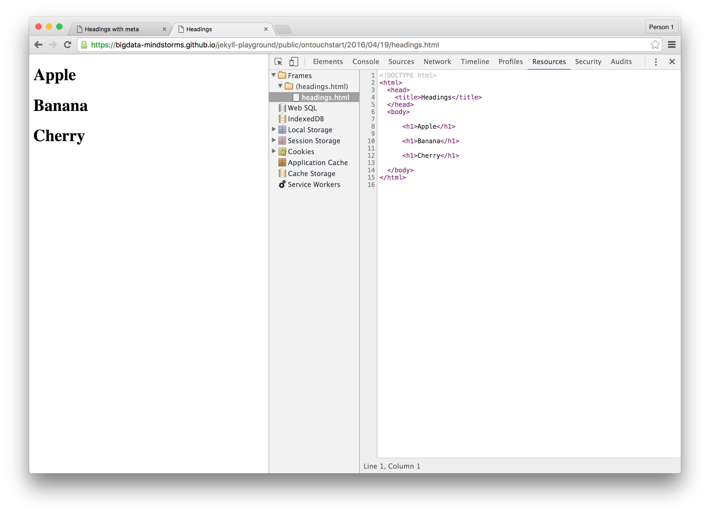
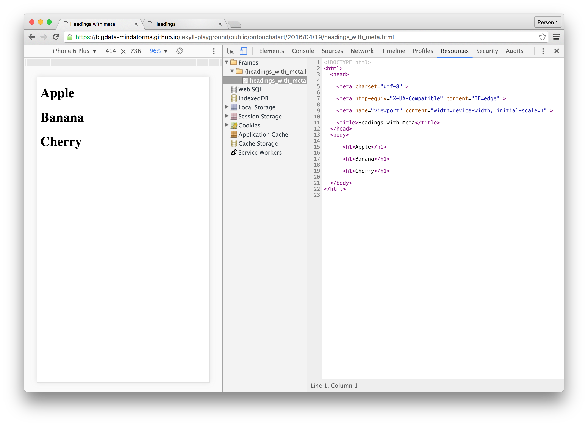
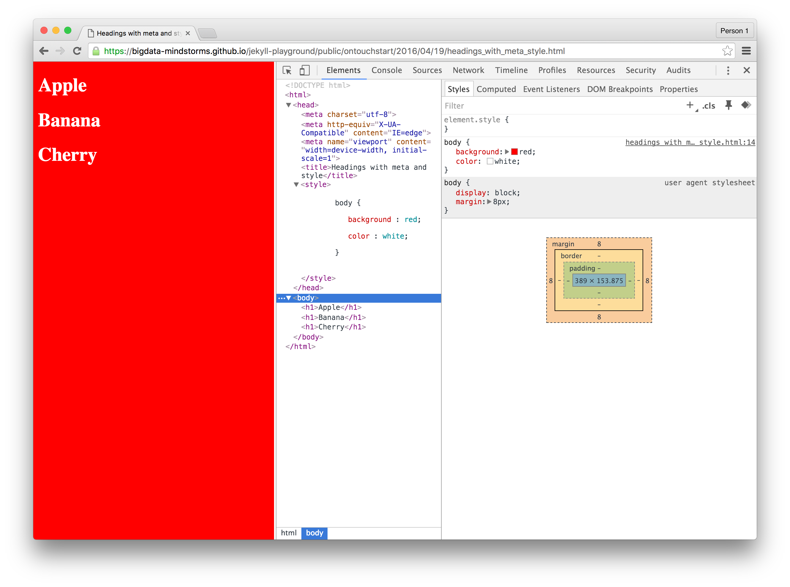

# Single Page Prototypes with Jekyll Front Matter

In this lesson we learn how to make single page prototypes with [Jekyll Front Matter](https://jekyllrb.com/docs/frontmatter/).

## Blank Page

Here is a [blank page](https://bigdata-mindstorms.github.io/jekyll-playground/public/ontouchstart/2016/04/19/blank.html).
The source you can view in the browser is following:

```html
<!DOCTYPE html>
<html>
  <head>
  </head>
  <body>
  </body>
</html>
```
which is almost exactly like [our source](blank.html) except the empty [frontmatter](https://jekyllrb.com/docs/frontmatter/).

```
---
---
```

## Blank Page with a Title

Here is a [blank page with a title](https://bigdata-mindstorms.github.io/jekyll-playground/public/ontouchstart/2016/04/19/blank_title.html).

```html
<!DOCTYPE html>
<html>
  <head>
    <title>blank</title>
  </head>
  <body>
  </body>
</html>
```
the source is [here](blank_title.html).

Notice how we define and use [custom variable](https://jekyllrb.com/docs/frontmatter/#custom-variables) `{{ page.title }}` in the source.

## Headings 

Here is a [page with headings](https://bigdata-mindstorms.github.io/jekyll-playground/public/ontouchstart/2016/04/19/headings.html).

```html
<!DOCTYPE html>
<html>
  <head>
    <title>Headings</title>
  </head>
  <body>

      <h1>Apple</h1>

      <h1>Banana</h1>

      <h1>Cherry</h1>

  </body>
</html>
```
the source is [here](headings.html). Notice the use of [for loops](https://github.com/shopify/liquid/wiki/liquid-for-designers#for-loops) in [liquid templating engine](https://jekyllrb.com/docs/frontmatter/#custom-variables).

### meta

Here is a [blank page](https://bigdata-mindstorms.github.io/jekyll-playground/public/ontouchstart/2016/04/19/meta.html) with [meta tags](https://developer.mozilla.org/en-US/docs/Web/HTML/Element/meta) in the `head`.

```html
<!DOCTYPE html>
<html>
  <head>
  
    <meta charset="utf-8" >
  
    <meta http-equiv="X-UA-Compatible" content="IE=edge" >
  
    <meta name="viewport" content="width=device-width, initial-scale=1" >
  
  </head>
  <body>
  </body>
</html>
```
the source is [here](meta.html). Notice the use of double [for loops](https://github.com/shopify/liquid/wiki/liquid-for-designers#for-loops) in [liquid templating engine](https://jekyllrb.com/docs/frontmatter/#custom-variables). For hash item, we use `item[0]` for the key and `item[1]` for the value:

```

  <meta {{ item[0] }}="{{ item[1] }}" >

```

For meta tag
```html
<meta http-equiv="X-UA-Compatible" content="IE=edge" >
``` 
see [reference here](https://github.com/h5bp/html5-boilerplate/blob/master/src/doc/html.md#x-ua-compatible).

Following screenshots of 
[headings.html](https://bigdata-mindstorms.github.io/jekyll-playground/public/ontouchstart/2016/04/19/headings.html) 
and
[headings_with_meta.html](https://bigdata-mindstorms.github.io/jekyll-playground/public/ontouchstart/2016/04/19/headings_with_meta.html) 
demonstrate how `viewport` meta tag affects the web page viewed on desktop and mobile.

#### Without meta

Desktop


Mobile


#### With meta

Desktop


Mobile


### style

[style.html](https://bigdata-mindstorms.github.io/jekyll-playground/public/ontouchstart/2016/04/19/style.html)


```html
<!DOCTYPE html>
<html>
  <head>
    <title>White on Red</title>
    <style>
    
      body {
       
         background : red; 
       
         color : white; 

      }
    
    </style>
  </head>
  <body>
    <h1>White on Red</h1>
  </body>
</html>
```

Here is the [source](style.html), notice the double for loop

```
---
title : White on Red
style :
  body :
    background : red
    color : white
---
<!DOCTYPE html>
<html>
  <head>
    <title>{{ page.title }}</title>
    <style>
    
      {{ selector[0] }} {
       
         {{ css[0] }} : {{ css[1] }}; 
       
      }
    
    </style>
  </head>
  <body>
    <h1>{{ page.title }}</h1>
  </body>
</html>
```

### headings with meta and style

[headings_with_meta_style.html](https://bigdata-mindstorms.github.io/jekyll-playground/public/ontouchstart/2016/04/19/headings_with_meta_style.html)



[source](headings_with_meta_style.html)
